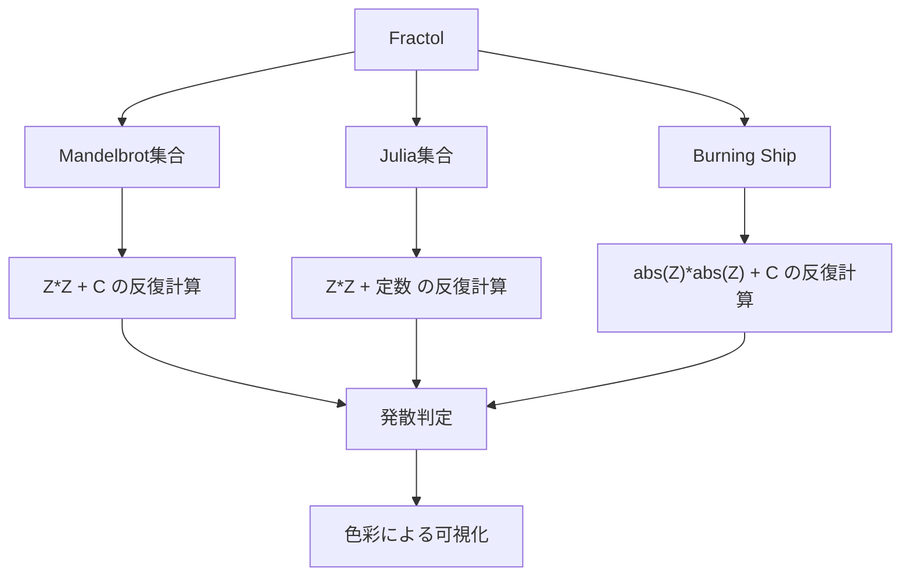
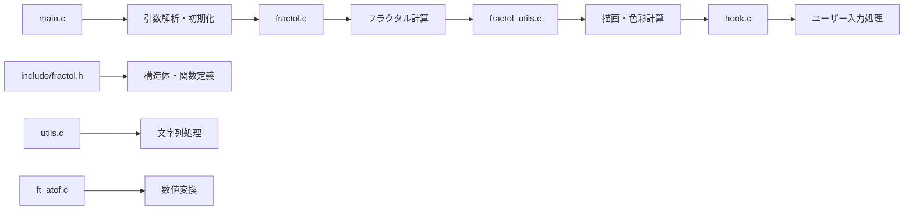
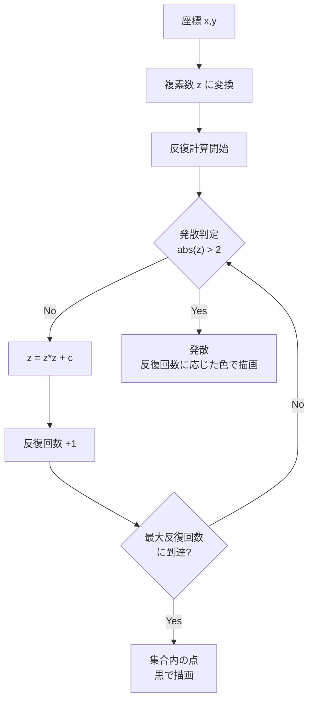

# Fractol

42 schoolのfractolプロジェクト - フラクタル図形の可視化プログラム

## 概要

Fractolは複数種類のフラクタル図形を美しく描画するグラフィカルアプリケーションです。数学的に興味深いフラクタル図形をリアルタイムで表示し、マウスホイールでのズーム機能により詳細な構造を探索できます。

## サポートするフラクタル



### 1. Mandelbrot集合
- 最も有名なフラクタル図形
- 複素数平面上で Z² + C の反復計算により生成
- 自己相似性を持つ美しい境界線

### 2. Julia集合
- Mandelbrot集合と密接な関係を持つフラクタル
- パラメータを変更することで様々な形状を生成
- デフォルト値: -0.8 + 0.125i

### 3. Burning Ship
- Mandelbrot集合の変種
- 絶対値を使用した特殊な計算式
- 船のような独特な形状

## システム要件

- macOS (MinilibX対応)
- C言語コンパイラ (clang/gcc)
- OpenGL Framework
- AppKit Framework

## インストール

```bash
git clone <repository_url>
cd 42_fractol
make
```

## 使用方法

### 基本実行

```bash
# Mandelbrot集合を表示
./fractol mandelbrot

# Julia集合を表示（デフォルトパラメータ）
./fractol julia

# Julia集合を表示（カスタムパラメータ）
./fractol julia -0.8 0.125

# Burning Ship を表示
./fractol burning-ship
```

### 操作方法

| 操作 | 機能 |
|------|------|
| マウスホイール↑ | ズームイン |
| マウスホイール↓ | ズームアウト |
| ESCキー | 終了 |
| ウィンドウ×ボタン | 終了 |

## プロジェクト構造



### ファイル構成

```
fractol/
├── Makefile                # ビルド設定
├── main.c                  # メイン関数・初期化
├── fractol.c              # フラクタル計算ロジック
├── fractol_utils.c        # 描画・色彩・発散判定
├── hook.c                 # イベント処理
├── utils.c                # ユーティリティ関数
├── ft_atof.c             # 文字列→浮動小数点変換
├── include/
│   └── fractol.h         # ヘッダファイル
└── minilibx_mms_20200219/ # グラフィックライブラリ
```

## 技術的な特徴

### フラクタル計算アルゴリズム



### 色彩計算
- 発散速度に基づく色彩表現
- 立方計算による滑らかなグラデーション
- 集合内部は黒色で表現

### ズーム機能
- リアルタイムでの倍率調整
- マウスホイールによる直感的操作
- 詳細構造の探索が可能

## パフォーマンス最適化

- `-O3` 最適化フラグの使用
- 効率的なピクセル描画
- メモリアクセスの最適化

## 作者

**kmiyazaw** - 42 Tokyo

## ライセンス

このプロジェクトは42 schoolの教育目的で作成されました。

## 参考資料

- [Mandelbrot Set - Wikipedia](https://en.wikipedia.org/wiki/Mandelbrot_set)
- [Julia Set - Wikipedia](https://en.wikipedia.org/wiki/Julia_set)
- [Burning Ship Fractal - Wikipedia](https://en.wikipedia.org/wiki/Burning_Ship_fractal)